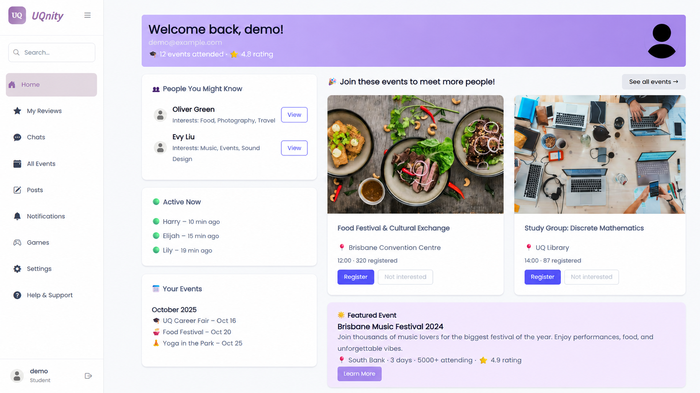
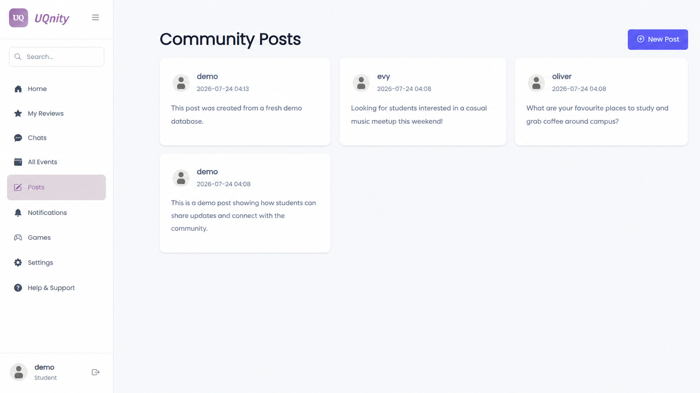
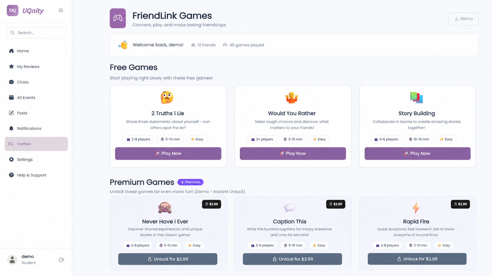
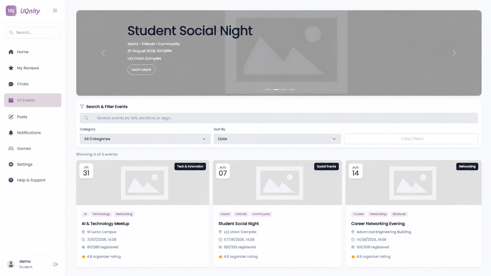

# UQnity – Student Social Platform

UQnity is a full-stack social platform MVP designed to help university students connect, communicate, discover events, and build friendships.

The application was developed as a five-member university team project.

## Screenshots

### Home Dashboard

The home dashboard provides personalized user suggestions, community highlights, and event discovery.



### Community Posts

The Posts module allows users to create and browse community posts, with content stored using SQLAlchemy and SQLite.



### FriendLink Games

The platform includes interactive friendship-building mini games designed to encourage social interaction between students.



### Event Discovery

Users can browse and filter upcoming events and view event information such as location, category, attendance, and organizer details.



## Features

- User registration, login, and profiles
- Community posts and social interactions
- Private messaging
- Event discovery and event details
- Reviews and notifications
- Friendship-building mini games

## Tech Stack

### Backend

- Python
- Flask
- SQLAlchemy
- Flask-Login
- Flask-WTF
- Flask-Bcrypt

### Frontend

- HTML
- CSS
- JavaScript
- Jinja Templates

### Database

- SQLite
- Flask-SQLAlchemy
- Flask-Migrate

## My Contribution

My primary contribution focused on the **Posts module** and related full-stack functionality.

I contributed to:

- Post creation, persistence, and display
- Flask routes and backend logic
- SQLAlchemy database operations
- Form handling and validation
- Frontend and Jinja template integration
- Integration of post-related functionality with other parts of the platform

## Running Locally

### 1. Install the required dependencies

```bash
pip install -r requirements.txt
```

### 2. Initialize the demo database

```bash
python init_demo_db.py
```

This creates a local SQLite database with demo users, posts, and events.

A demo account is available for testing:

```text
Username: demo
Password: Demo123!
```

### 3. Run the application

```bash
python run.py
```

### 4. Open the application

Open the following address in your browser:

```text
http://127.0.0.1:5000
```

The local SQLite database is excluded from version control and is generated locally using `init_demo_db.py`.

## Project Context

This repository contains a cleaned and maintained copy of a university team project for portfolio and learning purposes.

The original application was collaboratively developed by a five-member team. My primary contribution focused on the Posts module and related full-stack functionality.

Some features in the MVP were implemented using demo or mock data as part of the original prototype and development process.